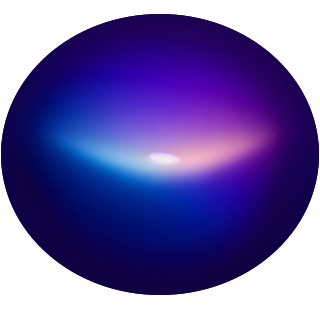

Indigobot Documentation
=======================

Welcome to Indigobot's documentation. This project provides a sophisticated RAG (Retrieval-Augmented Generation) system using LangChain for intelligent document processing and retrieval.
This project was created by a team of students at Portland State University for a Computer Science capstone project.

Overview
--------

Indigobot is designed to enhance information retrieval and generation through a combination of advanced AI techniques and efficient data processing. The system intelligently crawls, processes, and retrieves information from various sources to provide accurate and contextually relevant responses.

Key Features
------------

* **Advanced RAG Implementation**: Uses state-of-the-art OpenAI LLM models with context-aware retrieval
* **Intelligent Web Crawling**: Built-in crawler with rate limiting, retry mechanisms, and content extraction
* **Vectorstore Management**: Uses Chroma for efficient document embedding storage and similarity search
* **Places Information Tool**: Integration with Google Places API for location-based information
* **Modular Architecture**: Easily extensible for custom document processors and tools
* **Caching System**: Optimizes performance by caching frequent queries and responses
* **API Integration**: Ready-to-use FastAPI implementation for web service deployment

Configuring program
-------------------

The project requires the following environment variables to be set:

* ``OPENAI_API_KEY``: Your OpenAI API key
* ``GPLACES_API_KEY``: Your Google Places API key for the Places Lookup Tool
* ``CHROMA_PERSIST_DIRECTORY``: Directory for storing vector embeddings (default: ./chroma_db)

Architecture
------------

.. code-block::

   ┌─────────────────┐     ┌───────────────┐     ┌────────────────┐
   │  Web Crawler    │────▶│ Document      │────▶│ Text Splitter  │
   │  & Loader       │     │ Processor     │     │                │
   └─────────────────┘     └───────────────┘     └────────┬───────┘
                                                          │
                                                          ▼
   ┌─────────────────┐     ┌───────────────┐     ┌────────────────┐
   │  RAG Engine     │◀────│ Vector Store  │◀────│ Embedding      │
   │                 │     │ (Chroma)      │     │ Generation     │
   └────────┬────────┘     └───────────────┘     └────────────────┘
            │
            ▼
   ┌─────────────────┐     ┌───────────────┐
   │  LLM            │────▶│ Response      │
   │  Integration    │     │ Generation    │
   └─────────────────┘     └───────────────┘

Core Components
---------------

* **Web Crawler**: Intelligently crawls and extracts web content with customizable depth
* **Document Loader**: Processes various document formats including HTML and plain text
* **Vector Store**: Manages document embeddings with semantic search capabilities
* **RAG Engine**: Coordinates retrieval and generation with context management
* **Places Lookup Tool**: Retrieves and formats supplementary place information
* **Caching System**: Reduces latency and API costs by caching frequent queries

Documentation
-------------

.. toctree::
   :maxdepth: 1
   :caption: Getting Started

   installation
   quickstart

.. toctree::
   :maxdepth: 1
   :caption: User Guide

   usage

.. toctree::
   :maxdepth: 2
   :caption: API Reference

   modules

.. toctree::
   :maxdepth: 1
   :caption: Development

   contributing
   changelog

License
-------

This project is licensed under the GNU General Public License v3.0 - see the LICENSE file for details.
